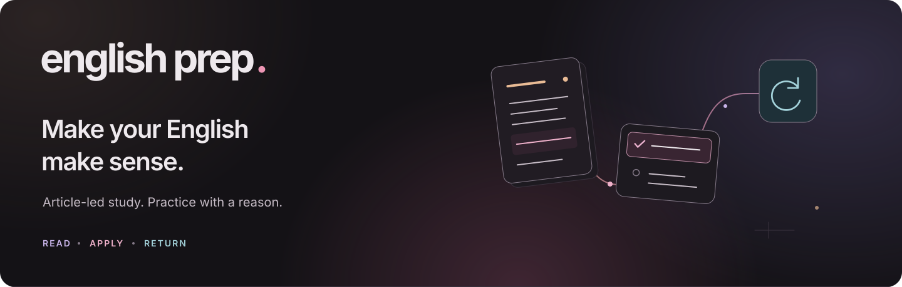
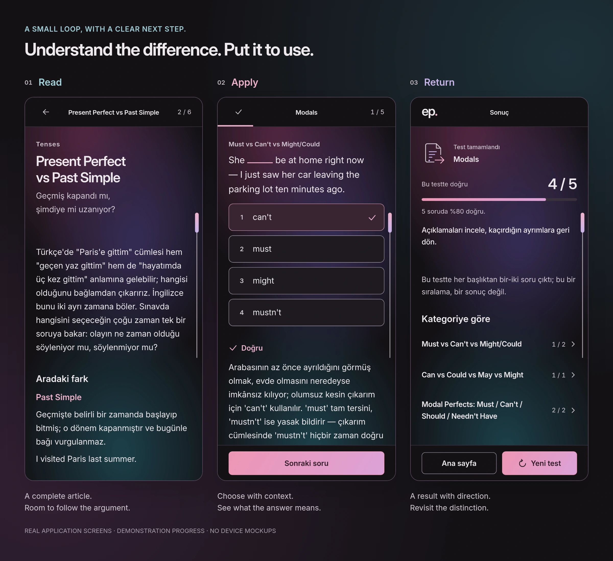
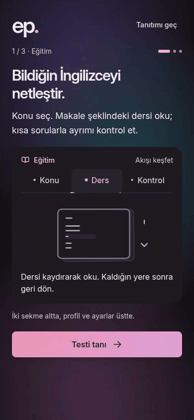
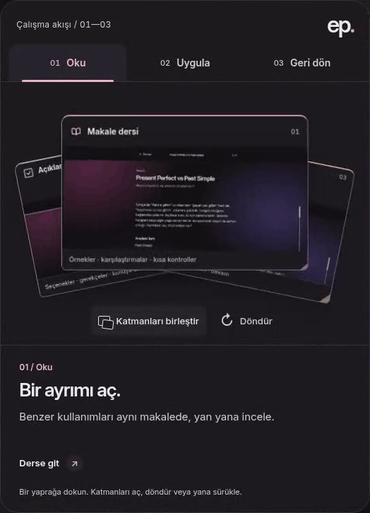
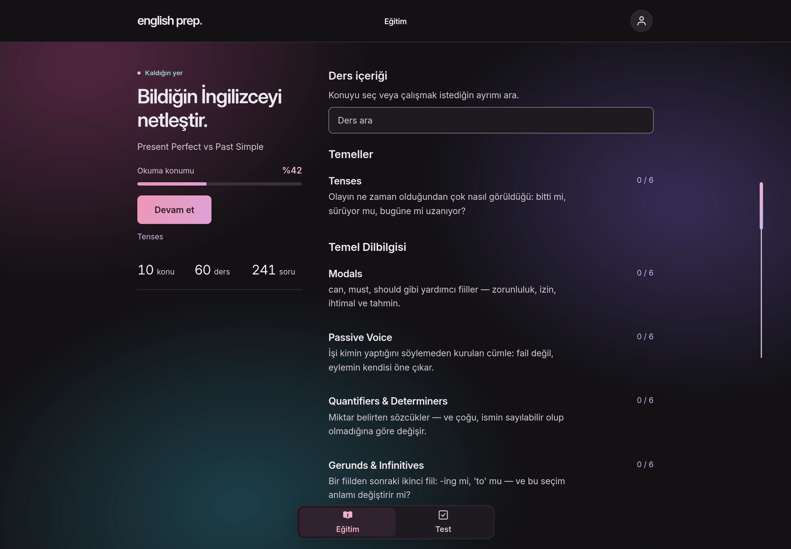
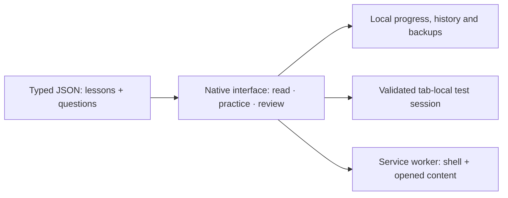

<p align="center">
  <a href="https://erendenizk.github.io/english-prep/">
    <picture>
      <source media="(max-width: 600px)" srcset="docs/github/brand-compact.svg">
      
    </picture>
  </a>
</p>

<p align="center">
  <strong>A focused study space for the English you understand — and the distinctions you still miss.</strong><br>
  Turkish explanations. English examples. An article first, a test when you are ready.
</p>

<p align="center">
  <a href="https://erendenizk.github.io/english-prep/"><strong>Open the app ↗</strong></a>&nbsp; · &nbsp;
  <a href="https://erendenizk.github.io/english-prep/about/">Explore the product</a>&nbsp; · &nbsp;
  <a href="https://github.com/ErenDenizK/english-prep/blob/test/docs/VALIDATION.md">See the evidence</a>
</p>

<p align="center">
  <strong>10</strong> topics &nbsp; / &nbsp; <strong>60</strong> lessons &nbsp; / &nbsp;
  <strong>241</strong> questions &nbsp; / &nbsp; <strong>723</strong> option notes
</p>

## From “that sounds right” to “I know why”

English Prep is for learners with an existing English foundation preparing for
Turkish university proficiency exams. Each lesson explores a useful distinction:
*Present Perfect vs Past Simple*, *Must vs Have to*, or the difference one connector
makes to a sentence. It gives a name and a reason to knowledge you already use.

| Read the distinction | Apply it in context | Return with a reason |
| --- | --- | --- |
| Scroll through a complete article. Compare forms, examples and common mistakes at your own pace. | Choose a topic, a mixed test or your mistake notebook. See why an answer fits the actual sentence. | Follow an explanation back to the relevant lesson. Continue from your saved reading position. |

<a href="https://erendenizk.github.io/english-prep/">
  
</a>

<sub>Real browser captures with demonstration progress. Open the app to interact; these are not physical-device certification images.</sub>

<details>
<summary><strong>Watch the introduction in motion</strong> — a short, optional demo</summary>



The recording runs in an isolated demo browser. The app honors reduced motion
and has a persistent animation preference in Profile settings. GitHub GIF playback
has no equivalent per-viewer motion control, so this preview is kept inside a
closed disclosure. A [static introduction frame](docs/github/introduction.webp) is also available.

</details>

<details>
<summary><strong>Turn the product over</strong> — explore the interactive folio</summary>



Real interactions from the [product portfolio](https://erendenizk.github.io/english-prep/about/).
The folio can be explored with touch, pointer and keyboard. This recording uses
actual app captures inside the live illustration; it is not a prerecorded UI
inside the product. [Static view](docs/github/folio.webp).

</details>

## Two tabs. Room to think.

**Eğitim** holds the articles. **Test** holds the practice. Profile and settings
stay within reach from the header. No exam-date setup, streak pressure or daily
quota stands between you and the material.

- **Questions that explain the difference.** Feedback includes the correct answer,
  a transferable rule, and what your chosen alternative would mean.
- **A mistake notebook with a purpose.** A question leaves after correct answers
  on two separate days. Getting it wrong restarts that review history.
- **Continuity on your terms.** Reading position, completed lessons and test
  history stay in your browser. Preview a backup before you download it, copy
  its JSON text or share its file through a supported native share sheet. Restore
  through the existing import flow; there is no background upload.
- **A considered reading surface.** Bounded line lengths, measured type roles and
  neutral sentence text sit within a dark-first Sakura, iris, lagoon and plum palette.
  Meaning also comes from labels and shapes, never color alone.
- **An app that fits its screen.** Focused articles on a phone; useful supporting
  columns on a wider display. Install it from a supported browser. Previously
  opened material remains available offline while its browser cache is retained.

<details>
<summary><strong>At your desk</strong> — the same app, with space for context</summary>



A real 1440 × 1000 CSS-pixel viewport captured at 2× density. Wider layouts add
useful context beside a bounded reading area; they do not stretch paragraphs
across the screen. Demonstration reading progress is shown.

</details>

There is no account, application backend, analytics or automatic device sync.
The material targets parts of the YTÜ İYS-style exam; this is not complete exam
coverage or a prediction of a learner's result.

## Simple delivery. Deliberate engineering.

Plain HTML, CSS and ES modules, served directly from GitHub Pages. No build step
or runtime dependencies. Content and interface are separate, so a lesson can
change without redesigning a screen.



| Decision | What it protects |
| --- | --- |
| JSON rendered through DOM nodes and `textContent` | Teaching material stays separate from presentation; no `innerHTML` rendering. |
| Validated local state and a recoverable test session | A refresh can recover an in-progress attempt without inventing an answer. |
| Cancellable, state-driven motion | Input and scoring commit immediately. Replaced or hidden scenes stop their effects. |
| Contrast checks, browser journeys and content validation | Design intent has executable checks, with limitations recorded alongside results. |
| Preserved earlier interfaces and source archive | The redesign can be compared with the original rather than replacing its history. |

The corpus also has an editorial process: blind question solving, lesson
sufficiency review and independent re-audits. Automated validation complements
those reviews; it cannot decide whether a distractor has a second defensible meaning.

[Architecture and design decisions](https://github.com/ErenDenizK/english-prep/tree/test/docs/adr) ·
[Interface system](https://github.com/ErenDenizK/english-prep/blob/test/docs/margin-design-system.md) ·
[Research](https://github.com/ErenDenizK/english-prep/tree/test/docs/research) ·
[Content authoring](https://github.com/ErenDenizK/english-prep/blob/test/docs/CONTENT_GUIDE.md)

## Run it locally

```bash
git clone --branch test https://github.com/ErenDenizK/english-prep.git
cd english-prep
npm run serve
# Open http://localhost:8000/
```

Python 3 serves the files; Node.js runs the repository tooling. There is no
`npm install` step. A `file://` URL will not work because lessons load with `fetch()`.

```bash
npm run check    # Content, formatting, palette and Node tests
npm run verify   # Browser journeys; requires the server and Chromium tooling
```

[Development and content guide](https://github.com/ErenDenizK/english-prep/blob/test/docs/development.md) ·
[Validation commands and limits](https://github.com/ErenDenizK/english-prep/blob/test/docs/VALIDATION.md) ·
[Changelog](https://github.com/ErenDenizK/english-prep/blob/test/CHANGELOG.md) ·
[Roadmap](https://github.com/ErenDenizK/english-prep/blob/test/docs/roadmap.md)

## A visible design history

The live app is published from **`test`**. The repository's default-branch
presentation links to that source explicitly; **`main` retains the original MVP
runtime**. A push to `test` is a deployment, so checks happen before publication.

[Current app](https://erendenizk.github.io/english-prep/) ·
[Full original interface](https://erendenizk.github.io/english-prep/original/) ·
[Earlier prototype](https://erendenizk.github.io/english-prep/legacy/) ·
[Unchanged original source ZIP](https://erendenizk.github.io/english-prep/original/source-39dcd46.zip)

The historical hosted versions share the origin's local progress and settings;
their offline caches are isolated. Current browser evidence, real-device gaps
and content limits are documented openly. No learner study, physical iPhone
certification or universal reading-comfort claim is implied by an automated pass.

---

Built by **[ErenDenizK](https://github.com/ErenDenizK)**. Product, interface and
engineering notes live alongside the code. [How these presentation assets are made](docs/github/README.md).
